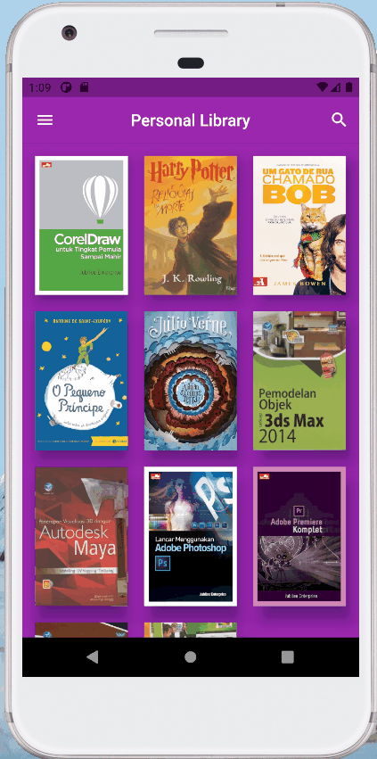

# Biblioteca Virtual 📚
>Projeto realizado para desenvolver habilidades em Flutter

### Objetivo da aplicação 🎇

- Com o intuito de digitalizar os livros que estão na estante, as principais funcionalidades são cadastro e listagem de livros bem como suas informações (título, autor, quantidade de páginas...)além de adicionar nota de 1 a 5 estrelas. A ideia é uma biblioteca pessoal simples com login, porém posteriormente poderá ser evoluido para um clube de livros onde será possível realizar trocas de exemplares por um número acordado de dias.

---
### Telas 📱

- [x] Login
- [x] Listagem de livros
- [x] Detalhes do livro

---
### Libs Utilizadas 📌

- [flutter_svg](https://pub.dev/packages/flutter_svg)
- [cupertino_icons](https://pub.dev/packages/cupertino_icons)

Made with 💜 by [@manuletsgo](https://github.com/manuletsgo) and [@muller_debi](https://github.com/MullerDeb)